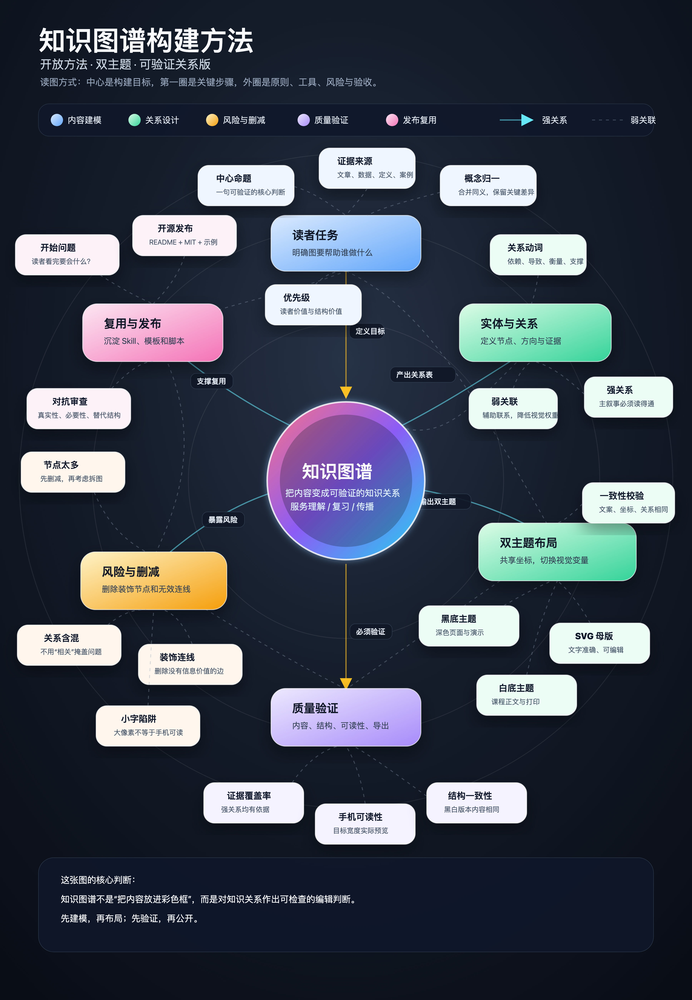
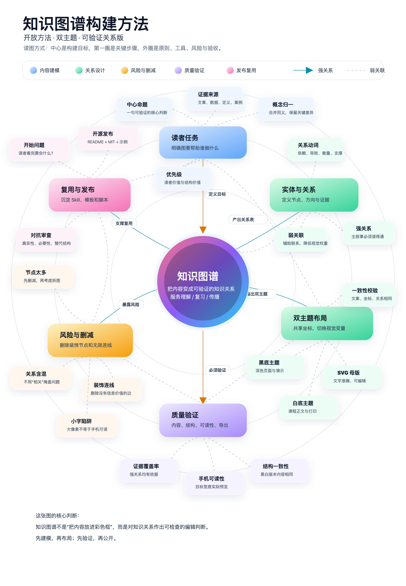

# Build Knowledge Graph Visuals

一个面向 Codex 的开源 Skill：从中文课程文章、技术专栏和长文中抽取有证据的知识实体与关系，生成可编辑的竖版知识图谱，并同时输出黑底、白底高清版本。

它拒绝把“不同颜色的框 + 大量装饰连线”冒充知识图谱。核心顺序是：先建模，再布局；先验证，再公开。

| 黑底示例 | 白底示例 |
|---|---|
|  |  |

## 能做什么

- 从多篇中文文章中抽取核心对象、问题、机制、约束、指标和实践产出。
- 为每个节点和强关系保留原文证据，区分明确结论与编辑推断。
- 先判断内容是否真的适合知识图谱，必要时改用流程图、层级图或表格。
- 支持 `mobile` 手机直读和 `poster` 深度海报两档密度。
- 以 SVG 为母版，输出同构的黑底、白底 PNG/JPG。
- 自动检查黑白版本的文字、坐标和关系结构是否一致。
- 内置第一性原理、对抗式审查和视觉 QA 清单。

## 安装

使用 Skills CLI：

```bash
npx -y skills add https://github.com/songwenjing860-source/build-knowledge-graph-visuals --skill build-knowledge-graph-visuals -y
```

也可以手动安装：

```bash
git clone https://github.com/songwenjing860-source/build-knowledge-graph-visuals.git
cp -R build-knowledge-graph-visuals ~/.codex/skills/
```

安装后重新打开 Codex。

## 使用

```text
使用 $build-knowledge-graph-visuals，根据这些课程文章制作一张竖版知识图谱，同时输出黑底和白底高清版本。
```

更明确的请求：

```text
使用 $build-knowledge-graph-visuals，把这组文章整理成 poster 密度的竖版知识图谱。
先给出节点表、关系表和推断声明，再生成同构的黑底/白底 SVG 与 2 倍 PNG。
交付前执行第一性原理和对抗式审查，删除装饰节点和无证据关系。
```

## 默认交付物

```text
<topic>-graph-spec.md
<topic>-knowledge-graph-dark.svg
<topic>-knowledge-graph-dark.png
<topic>-knowledge-graph-light.svg
<topic>-knowledge-graph-light.png
```

## 关键原则

1. 节点是知识对象，不是文章目录。
2. 连线必须有可读的关系动词。
3. 强关系必须有证据或明确标注为推断。
4. 黑白版本共用节点、坐标和关系，只切换主题变量。
5. 大像素不等于手机可读；必须在目标显示宽度下检查。
6. 如果交叉关系不是理解内容的必要条件，就不要硬做知识图谱。

## 项目结构

```text
build-knowledge-graph-visuals/
├── SKILL.md
├── README.md
├── LICENSE
├── agents/openai.yaml
├── assets/examples/
├── references/
│   ├── modeling-method.md
│   ├── theme-system.md
│   ├── adversarial-review.md
│   └── qa-checklist.md
└── scripts/
    ├── compare_svg_structure.py
    └── render_svg.py
```

## English

This repository contains a Codex skill for turning Chinese long-form content into evidence-backed, mobile-aware knowledge graph visuals. It produces editable SVG sources, matching dark/light themes, high-resolution exports, and explicit adversarial review checks.

## License

MIT License. See [LICENSE](LICENSE).
