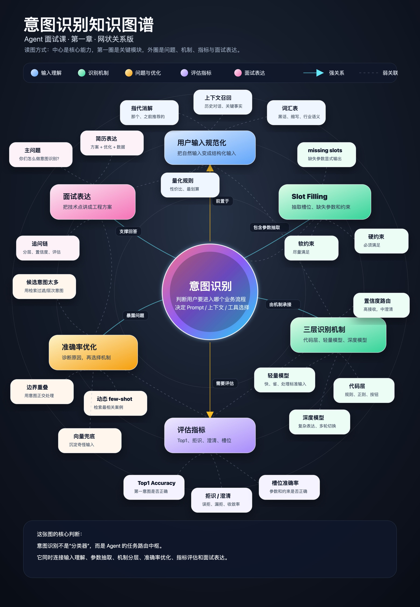
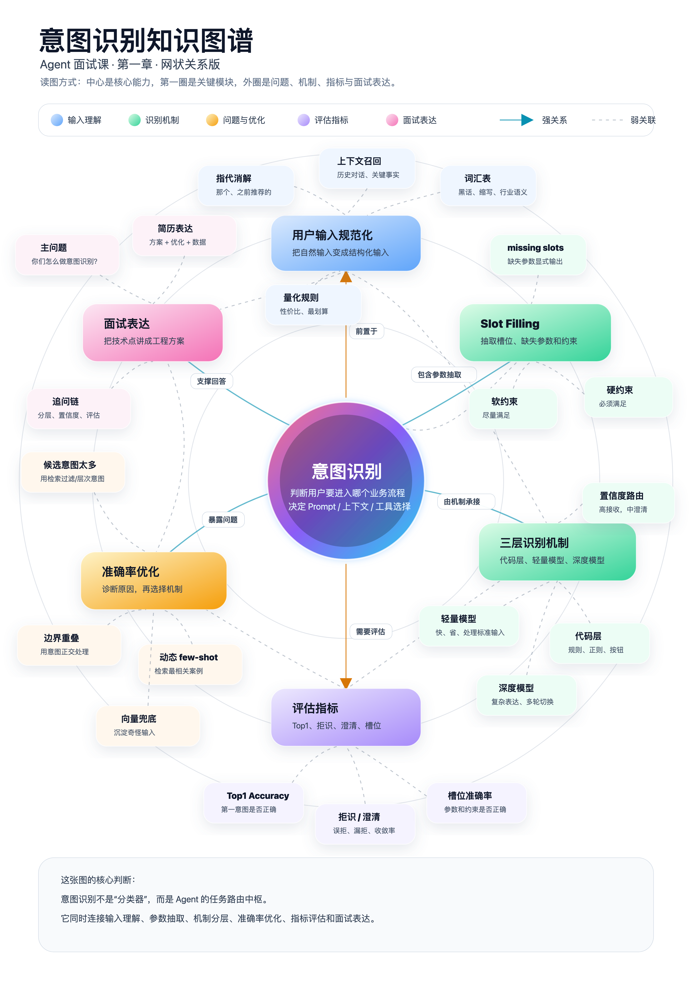
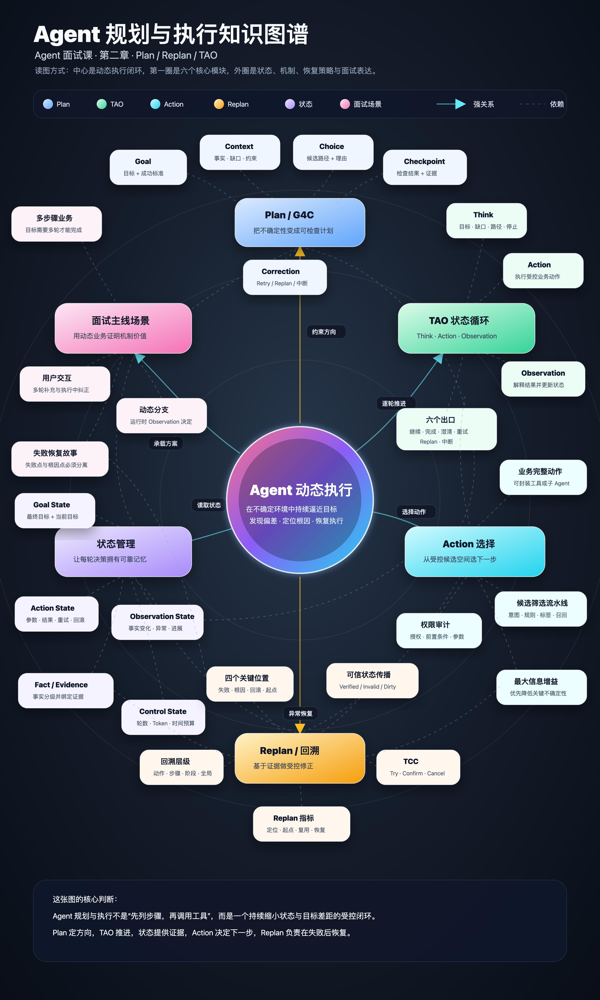
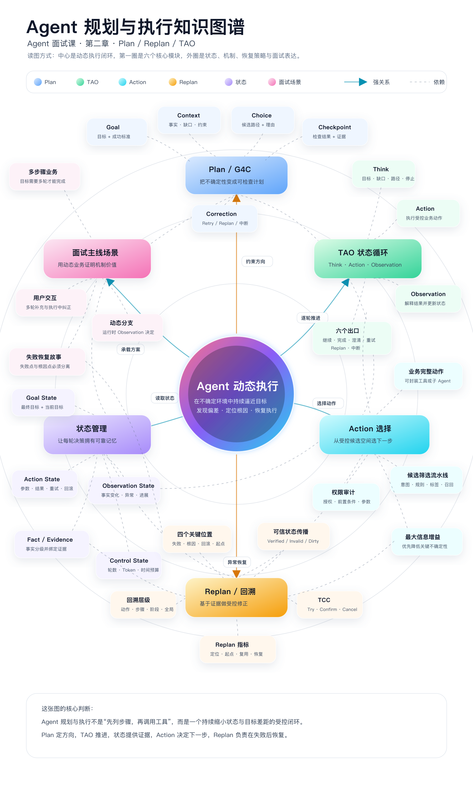
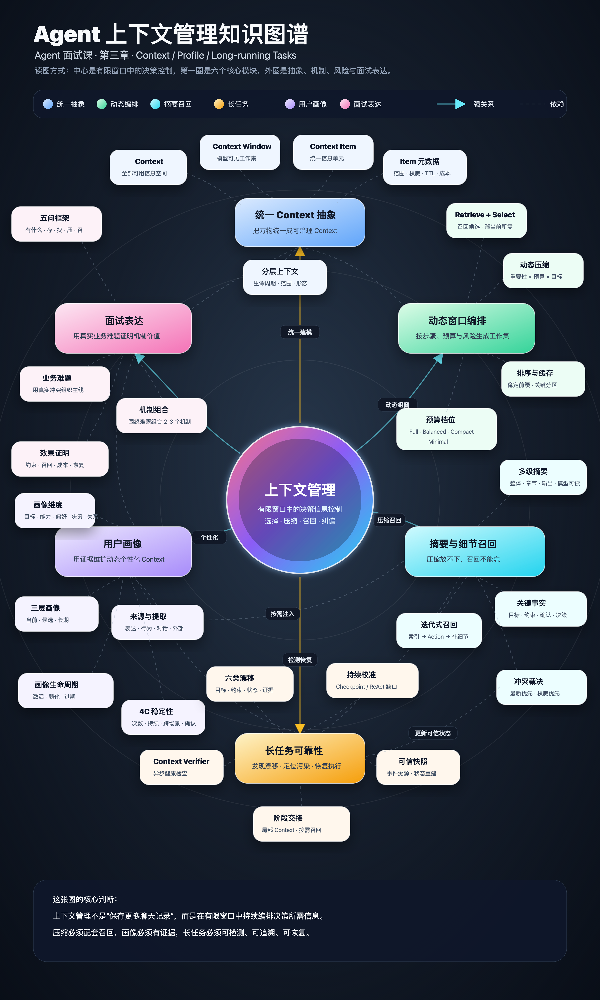
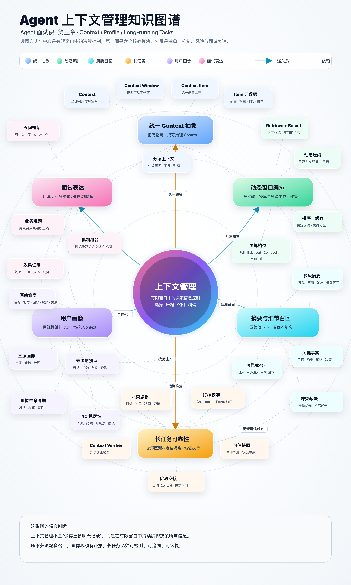
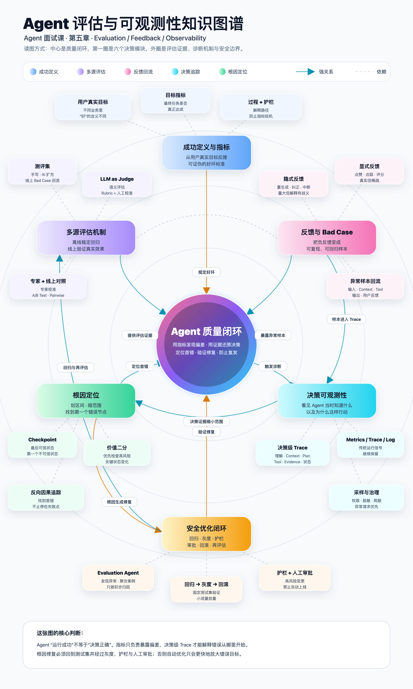

# Build Knowledge Graph Visuals

一个面向 Codex 的开源 Skill：从中文课程文章、技术专栏和长文中抽取有证据的知识实体与关系，通过确定性径向或叙事闭环模板生成可编辑的竖版知识图谱，并同时输出黑底、白底高清版本。

它拒绝把“不同颜色的框 + 大量装饰连线”冒充知识图谱。核心顺序是：先建模，再布局；先验证，再公开。

以下是用户认可的课程图谱效果，也是 Skill 的首选视觉参考：中心渐变圆、环绕模块、外围知识节点、明确关系和底部总结框。

| 意图识别 · 黑底 | 意图识别 · 白底 |
|---|---|
|  |  |

| 规划执行 · 黑底 | 规划执行 · 白底 |
|---|---|
|  |  |

| 上下文管理 · 黑底 | 上下文管理 · 白底 |
|---|---|
|  |  |

跨模块反馈关系示例：



参考文件及复用规则见 [课程参考样式](skills/build-knowledge-graph-visuals/references/course-reference-style.md)。附规划执行、上下文管理两份白底 SVG。历史参考图用于视觉校准；新内容仍须重新建模和检查。现有径向脚本容量小于六模块密集参考，复现该密度时需要扩展确定性模板。旧方法论和 Story Loop 示例保留为回归样例与可选风格。

## 能做什么

- 从多篇中文文章中抽取核心对象、问题、机制、约束、指标和实践产出。
- 为每个节点和强关系保留原文证据，区分明确结论与编辑推断。
- 先判断内容是否真的适合知识图谱，必要时改用流程图、层级图或表格。
- 支持 `mobile-radial`、`poster-radial` 与高密度 `story-loop` 三种 profile。
- 以 SVG 为母版，输出同构的黑底、白底 PNG/JPG。
- 自动检查黑白版本的文字、坐标和关系结构是否一致。
- JSON 内置证据注册表；节点和关系必须通过 `evidence_id` 回指真实来源。
- 使用浏览器真实字体度量检查节点文字、关系标签和画布越界。
- 自动生成 390 px 宽移动端整图及上、中、下审查裁切图。
- 内置第一性原理、对抗式审查和视觉 QA 清单。
- v2 使用结构化 JSON 和确定性渲染器，固定中心、环层、节点槽位、配色与字体层级，避免每次重新发明布局。
- 提供 `poster-radial` 和 `mobile-radial` 两个严格 profile；内容超限时要求删减或拆图。
- 内置 poster/mobile 回归 fixture 与 `self_test.py`，防止后续修改破坏安全区和节点布局。
- v3 新增 `story-loop`：以固定双列槽位、六类语义配色和可验证关系路由表达“前提—闭环—检验—约束”。

## 安装

使用 Skills CLI：

```bash
npx -y skills add https://github.com/songwenjing860-source/build-knowledge-graph-visuals --skill build-knowledge-graph-visuals -y
```

也可以手动安装：

```bash
git clone https://github.com/songwenjing860-source/build-knowledge-graph-visuals.git
cp -R build-knowledge-graph-visuals/skills/build-knowledge-graph-visuals ~/.codex/skills/
```

安装后重新打开 Codex。

## 使用

```text
使用 $build-knowledge-graph-visuals，根据这些课程文章制作一张竖版知识图谱，同时输出黑底和白底高清版本。
```

更明确的请求：

```text
使用 $build-knowledge-graph-visuals，把这组文章整理成 poster 密度的竖版知识图谱。
先给出节点表、关系表和推断声明，再生成同构的黑底/白底 SVG 与 2 倍 PNG。
交付前执行第一性原理和对抗式审查，删除装饰节点和无证据关系。
```

需要接近课程叙事长图时，明确要求 `story-loop`：

```text
使用 $build-knowledge-graph-visuals，把这组文章制作成 comprehensive story-loop。
保留“前提—行动—结果—检验—约束”的阅读主线，并在交付前执行渲染、查看和修正循环。
```

## 默认交付物

```text
<topic>-graph-spec.md
<topic>-graph-spec.json
<topic>-knowledge-graph-dark.svg
<topic>-knowledge-graph-dark.png
<topic>-knowledge-graph-light.svg
<topic>-knowledge-graph-light.png
```

## 关键原则

1. 节点是知识对象，不是文章目录。
2. 连线必须有可读的关系动词。
3. 所有节点和关系必须引用有效证据；编辑推断必须标注为 `inferred`。
4. 黑白版本共用节点、坐标和关系，只切换主题变量。
5. 大像素不等于手机可读；必须在目标显示宽度下检查。
6. 如果交叉关系不是理解内容的必要条件，就不要硬做知识图谱。

## 项目结构

```text
build-knowledge-graph-visuals/
├── README.md
├── LICENSE
└── skills/build-knowledge-graph-visuals/
    ├── SKILL.md
    ├── agents/openai.yaml
    ├── assets/examples/
    ├── references/
    │   ├── modeling-method.md
    │   ├── spec-v2.md
    │   ├── spec-v3-story-loop.md
    │   ├── theme-system.md
    │   ├── adversarial-review.md
    │   ├── implementation-notes.md
    │   └── qa-checklist.md
    └── scripts/
        ├── compare_svg_structure.py
        ├── build_graph.py
        ├── build_story_graph.py
        ├── validate_svg_geometry.py
        ├── make_mobile_previews.py
        ├── self_test.py
        └── render_svg.py
```

## English

This repository contains a Codex skill for turning Chinese long-form content into evidence-backed, mobile-aware knowledge graph visuals. It produces editable SVG sources, matching dark/light themes, high-resolution exports, and explicit adversarial review checks.

## License

MIT License. See [LICENSE](LICENSE).
